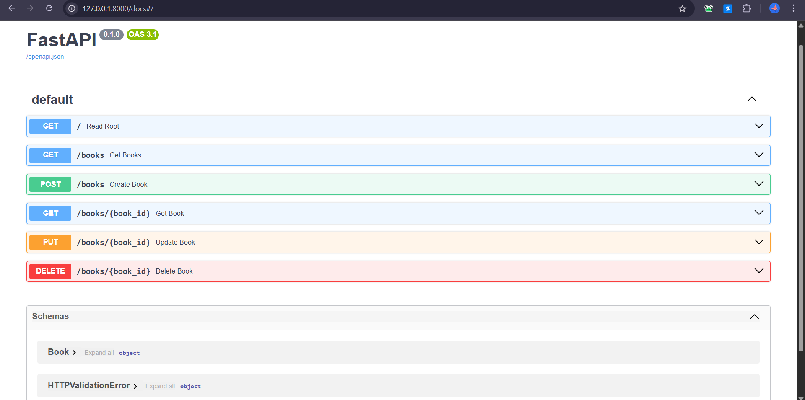

# 📘 FastAPI CRUD App – Book Manager

This is a lightweight backend API built with **FastAPI**, demonstrating basic **CRUD operations** (Create, Read, Update, Delete) for managing a simple list of books. The app uses FastAPI's auto-generated Swagger UI for easy testing and interaction.

---

## 🛠️ Tech Stack

- **Python**
- **FastAPI** – Web framework
- **Pydantic** – Data validation
- **Uvicorn** – ASGI server

---

## 📚 Features

- Create a book (POST `/books`)
- Get all books (GET `/books`)
- Get a book by ID (GET `/books/{book_id}`)
- Update a book (PUT `/books/{book_id}`)
- Delete a book (DELETE `/books/{book_id}`)
- Interactive Swagger UI at `/docs`

---

## 📸 Screenshots

### 🔎 Swagger UI Documentation


---

## 🚀 Getting Started

### ✅ 1. Clone the Repository

```bash
git clone https://github.com/your-username/fastapi-crud-app.git
cd fastapi-crud-app
```

### ✅ 2. Install Dependencies

```bash
pip install fastapi uvicorn
```

### ✅ 3. Run the App

```bash
uvicorn main:app --reload
```
Visit the interactive API docs at http://127.0.0.1:8000/docs
